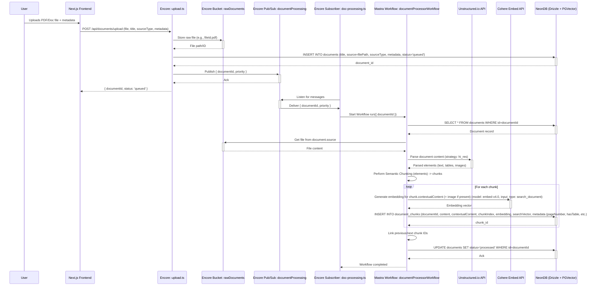
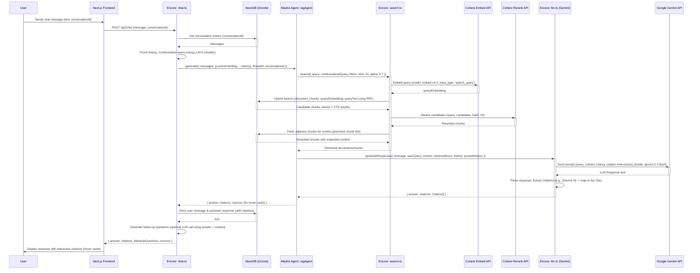

Okay, Architect! This is a comprehensive and well-thought-out plan. Let's structure this for clarity and action.

## RAG Chat Application Architecture & Implementation Plan

### 1. Architecture Overview

The system will be a modular, scalable RAG (Retrieval Augmented Generation) chat application.

**Core Technologies:**

*   **Backend**: EncoreTS (for services, APIs, pub/sub, buckets)
*   **AI Orchestration**: Mastra AI (for RAG agent and document processing workflow)
*   **Database**: NeonDB (PostgreSQL)
*   **Vector Storage**: PGVector extension within NeonDB
*   **ORM**: Drizzle ORM
*   **LLM (Generation)**: Google Gemini 2.5 Flash
*   **Embeddings Model**: Cohere embed-v4.0 (multimodal)
*   **Reranking Model**: Cohere Rerank
*   **Document Parsing**: Unstructured.io
*   **Frontend**: Next.js, Shadcn UI, Tailwind CSS, Tanstack Query
*   **Testing**: Vitest, DeepEval
*   **Deployment & Monitoring**: EncoreTS native capabilities

**High-Level Components:**

1.  **Frontend Application (Next.js)**: User interface for chat and document management.
2.  **EncoreTS Backend Services**:
    *   `UploadService`: Handles document uploads.
    *   `DocProcessingService` (Orchestrated by Mastra Workflow): Manages document parsing, chunking, and embedding.
    *   `SearchService`: Performs hybrid search and reranking.
    *   `ChatService` (Orchestrated by Mastra RAG Agent): Manages conversation flow, RAG, and LLM interaction.
    *   `DocMgmtService`: Handles CRUD operations for documents via a separate UI.
    *   `LLMService`: A wrapper service for interacting with the Gemini LLM.
3.  **Data Stores**:
    *   NeonDB: Stores metadata, text chunks, vector embeddings, conversation history.
    *   Encore Bucket (Object Storage): Stores raw uploaded files.
4.  **External Services**:
    *   Cohere API (Embeddings, Rerank)
    *   Google Gemini API (LLM)
    *   Unstructured.io API (Document Parsing)
5.  **Mastra AI Layer**:
    *   `documentProcessorWorkflow`: Orchestrates the steps involved in processing an uploaded document.
    *   `ragAgent`: Orchestrates the retrieval, context assembly, and generation for chat responses.

### 2. Mermaid Architecture Diagram

```mermaid
graph TD
    User[End User] -->|Interacts via HTTPS| Frontend[Next.js Frontend (Shadcn, Tailwind, Tanstack Query)]

    subgraph "EncoreTS Backend Services"
        Frontend -->|API Calls (HTTP/WebSocket)| APIGateway[API Gateway (Encore)]

        APIGateway -->|Authenticated Requests| ChatService[chat.ts (Encore Service)]
        APIGateway -->|Authenticated Requests| DocMgmtService[doc-mgmt.ts (Encore Service)]
        APIGateway -->|Authenticated Requests| UploadService[upload.ts (Encore Service)]

        UploadService -->|Stores Raw File| ObjectStorage[Encore Bucket (e.g., `rawDocuments`)]
        UploadService -->|Publishes Event `DocumentUploadEvent`| DocProcessingTopic[Pub/Sub: `documentProcessing` (Encore Topic)]

        DocProcessingSub[doc-processing.ts (Encore Subscriber)] -->|Consumes `DocumentUploadEvent`| DocProcessingWorkflow[Mastra Workflow: `documentProcessorWorkflow`]
        DocProcessingWorkflow -->|Retrieves Document| ObjectStorage
        DocProcessingWorkflow -->|Parses Document (Hi-Res PDF, etc.)| UnstructuredIO[Unstructured.io API Client]
        DocProcessingWorkflow -->|Chunks Document (Semantic)| ChunkingLogic[Internal Chunking Logic]
        DocProcessingWorkflow -->|Generates Embeddings| CohereEmbedClient[Cohere Embed API Client (embed-v4.0)]
        DocProcessingWorkflow -->|Stores Chunks, Embeddings, Metadata| NeonDB[(NeonDB with PGVector & Drizzle ORM)]

        ChatService -->|Orchestrates RAG Query| RAGAgent[Mastra Agent: `ragAgent`]
        RAGAgent -- Query --> SearchService[search.ts (Encore Service)]
        SearchService -->|Generates Query Embedding| CohereEmbedClient
        SearchService -->|Hybrid Search (Vector + FTS)| NeonDB
        SearchService -->|Reranks Results| CohereRerankClient[Cohere Rerank API Client]
        SearchService -- Ranked Chunks --> RAGAgent
        RAGAgent -- Query + Context + History --> LLMService[llm.ts (Encore Service for Gemini)]
        LLMService -->|Generates Response| GeminiLLMClient[Google Gemini 2.5 Flash API Client]
        LLMService -- Response --> RAGAgent
        RAGAgent -- Formatted Response + Citations --> ChatService
        ChatService -->|Stores/Retrieves History & Drafts| NeonDB
        ChatService -->|Handles Conversation Pruning| ConversationLogic[Internal Conversation Logic]

        DocMgmtService -->|Manages Documents/Chunks (CRUD)| NeonDB
    end

    subgraph "External APIs & SDKs"
        UnstructuredIO
        CohereEmbedClient
        CohereRerankClient
        GeminiLLMClient
    end

    subgraph "Data Persistence Layer"
        NeonDB
    end

    %% Styling
    style User fill:#f9f,stroke:#333,stroke-width:2px
    style Frontend fill:#ccf,stroke:#333,stroke-width:2px
    style APIGateway fill:#cce,stroke:#333,stroke-width:1px,linestyle:dashed
    style ObjectStorage fill:#ddf,stroke:#333,stroke-width:2px
    style DocProcessingTopic fill:#fcc,stroke:#333,stroke-width:2px
    style NeonDB fill:#cfc,stroke:#333,stroke-width:2px
    style UnstructuredIO fill:#ffc,stroke:#333,stroke-width:2px
    style CohereEmbedClient fill:#ffc,stroke:#333,stroke-width:2px
    style CohereRerankClient fill:#ffc,stroke:#333,stroke-width:2px
    style GeminiLLMClient fill:#ffc,stroke:#333,stroke-width:2px
    style DocProcessingWorkflow fill:#f9c,stroke:#333,stroke-width:2px
    style RAGAgent fill:#f9c,stroke:#333,stroke-width:2px


    classDef encoreSvc fill:#lightblue,stroke:#007bff,stroke-width:2px,color:#000; /* Changed text color to black for readability */
    class ChatService,DocMgmtService,UploadService,DocProcessingSub,SearchService,LLMService encoreSvc;

    classDef externalApi fill:#lightgrey,stroke:#555,stroke-width:2px;
    class UnstructuredIO,CohereEmbedClient,CohereRerankClient,GeminiLLMClient externalApi;
```

### 3. Data Flow Diagrams

**a. Document Ingestion Data Flow:**



**b. RAG Chat Query Data Flow:**



### 4. Integration Points Summary

*   **Frontend <-> Encore API Gateway**: HTTPS/WebSocket, Auth managed by Encore.
*   **Encore Services <-> NeonDB**: Drizzle ORM over SQL.
*   **Encore Services <-> Encore Bucket**: For raw file storage.
*   **Encore Services <-> Encore Pub/Sub**: Asynchronous tasking.
*   **Encore Services <-> Mastra SDK**: For invoking Agents and Workflows.
*   **Encore Services <-> External APIs (Cohere, Gemini, Unstructured)**: Secured HTTP/S calls, API keys via Encore secrets.
*   **Mastra <-> External APIs**: Mastra may also call these directly if configured within its steps.
*   **Configuration Management**: All secrets (API keys, DB URLs) will be managed via environment variables, sourced from Encore's secret management (`secret("MySecret")()`) or local `.env` files for development. No hardcoded secrets.

### 5. Vertical Slices (Implementation Plan)

The project will be developed in vertical slices. Each slice delivers a piece of end-to-end functionality.

---
<SLICING_TEMPLATE>
# Slice 1: Core Backend Foundation & DB Schema Setup
## What You're Building
This slice establishes the foundational backend services using EncoreTS, sets up the NeonDB database with Drizzle ORM, and defines the initial database schema including tables for documents, chunks, conversations, and messages with PGVector support.
## Tasks
### 1. Setup EncoreTS Project Structure - Complexity: 2
- [ ] Initialize a new EncoreTS application (`encore app create rag-chat-app`).
- [ ] Define basic service structure (`src/shared/`, `src/features/`).
- [ ] Configure `encore.app` with initial service definitions (empty services for `chat`, `upload`, `doc-processing`, `doc-mgmt`).
- [ ] Setup `package.json` with: `encore.dev`, `typescript`, `@types/node`, `drizzle-orm`, `pg`, `uuid`, `@types/uuid`.
- [ ] Initialize `tsconfig.json`.
- [ ] Write tests: A simple "hello world" Encore API endpoint in one service to check basic setup.
- [ ] Test passes locally (`encore run`, curl endpoint).
### 2. Configure NeonDB and Drizzle ORM - Complexity: 3
- [ ] Create a NeonDB project (e.g., via Neon console) and get the connection string.
- [ ] Set up Encore secrets for `NEON_DATABASE_URL`. For local dev, use a `.env` file and load it (or use Encore's local secret override).
- [ ] Add Drizzle ORM (`drizzle-orm`) and `pg` driver. Add `drizzle-kit` as a dev dependency.
- [ ] Create a Drizzle configuration file (`drizzle.config.ts`) pointing to the schema file and migrations folder.
- [ ] Setup an Encore shared module `src/shared/infrastructure/database/db.ts`:
    - Import `SQLDatabase` from `encore.dev/storage/sqldb`.
    - Create `new SQLDatabase("ragAppDB", { migrations: "./src/shared/infrastructure/database/migrations" });`.
    - Initialize Drizzle client: `const orm = drizzle(ragAppDB.connectionString, { schema });`.
- [ ] Write tests: A test function within an Encore service that attempts a simple query (e.g., `SELECT 1`) using the Drizzle client.
- [ ] Test passes locally.
    - **Subtask 2.1:** Define `NEON_DATABASE_URL` secret in Encore. - Complexity: 1
    - **Subtask 2.2:** Implement `db.ts` with `SQLDatabase` and Drizzle initialization. - Complexity: 2
### 3. Define Database Schema (Drizzle) - Complexity: 3
- [ ] Create `src/shared/infrastructure/database/schema.ts` with tables: `documents`, `documentChunks`, `conversations`, `conversationMessages` as per PRD.
- [ ] `documents.status`: Add a `status` field (e.g., `varchar('status', { length: 50 })`) to track processing state ('queued', 'processing', 'processed', 'error').
- [ ] `documentChunks.embedding`: Use `vector('embedding', { dimensions: 1024 })`.
- [ ] `documentChunks.searchVector`: Use `tsvector('search_vector').generatedAlwaysAs(...)`.
- [ ] `documentChunks`: Ensure `previousChunkId` and `nextChunkId` allow NULL and have foreign key constraints with `onDelete: 'set null'`.
- [ ] Define all specified indexes (HNSW on `embedding`, GIN on `searchVector`, GIN on `documents.metadata`, index on `document_chunks(documentId, chunkIndex)`).
- [ ] Generate initial Drizzle migrations: `bunx drizzle-kit generate`.
- [ ] Ensure migrations are correctly placed in the path specified for `SQLDatabase`.
- [ ] Write tests: After `encore run` applies migrations, use `db shell` or a test function to verify tables and indexes exist.
- [ ] Test passes locally.
### 4. Setup Mastra Basic Configuration - Complexity: 2
- [ ] Add `@mastra/core` dependency.
- [ ] Create `src/shared/infrastructure/mastra/config.ts`.
- [ ] Initialize Mastra: `new Mastra({ agents: {}, workflows: {}, telemetry: { serviceName: "rag-chat-app", enabled: true, export: { type: "otlp", endpoint: process.env.OTEL_ENDPOINT }}});`.
- [ ] Ensure `OTEL_ENDPOINT` is configurable via environment variables (Encore secrets).
- [ ] Write tests: A test function that initializes the Mastra client from `config.ts` without errors.
- [ ] Test passes locally.
## Code Example
```typescript
// src/shared/infrastructure/database/db.ts
import { SQLDatabase } from "encore.dev/storage/sqldb";
import { drizzle, NodePgClient } from 'drizzle-orm/node-postgres';
import * as schema from './schema'; // Your Drizzle schema
import { secret } from "encore.dev/config";

// Define your NeonDB connection string as an Encore secret
// For local development, this can be overridden or set via .env if not using Encore's local secret store
const databaseUrl = secret("NEON_DATABASE_URL");

// Define the Encore SQLDatabase resource
// Encore manages the actual database connection pool based on this definition.
// Migrations will be applied from the specified path.
export const ragAppDB = new SQLDatabase("ragappdb", {
  migrations: "./src/shared/infrastructure/database/migrations",
});

// Create a Drizzle ORM instance.
// Drizzle needs a connection *source*. Encore's ragAppDB.connectionString provides this.
// This getter (`ragAppDB.connectionString`) dynamically provides the correct connection string
// whether running locally, in preview, or in production, managed by Encore.
export const db: NodePgClient & { schema: typeof schema } = drizzle(
  ragAppDB.connectionString, // This is a getter function that provides the string
  { schema, logger: process.env.NODE_ENV === 'development' } // Enable logger in dev
);

// Example usage in an Encore service:
// import { db } from '../../shared/infrastructure/database/db';
// import { users } from '../../shared/infrastructure/database/schema';
// const allUsers = await db.select().from(users);
``````typescript
// src/shared/infrastructure/database/schema.ts
import {
  pgTable, serial, text, vector, integer, timestamp, jsonb, index, varchar, boolean,
  tsvector // Import tsvector
} from 'drizzle-orm/pg-core';
import { sql } from 'drizzle-orm';

export const documents = pgTable('documents', {
  id: serial('id').primaryKey(),
  title: text('title').notNull(),
  source: text('source').notNull(), // e.g., file path in object storage, URL
  sourceType: varchar('source_type', { length: 50 }).notNull(), // 'pdf', 'docx', 'url', 'text'
  metadata: jsonb('metadata').$type<{
    author?: string;
    createdDate?: string;
    tags?: string[];
    department?: string;
    accessLevel?: string;
    originalFileName?: string;
  }>(),
  status: varchar('status', { length: 20 }).default('queued').notNull(), // queued, processing, processed, error
  createdAt: timestamp('created_at', { withTimezone: true }).defaultNow().notNull(),
  updatedAt: timestamp('updated_at', { withTimezone: true }).defaultNow().notNull(),
}, (table) => ({
  documentsMetadataIdx: index('documents_metadata_idx').using('gin', table.metadata),
}));

export const documentChunks = pgTable('document_chunks', {
  id: serial('id').primaryKey(),
  documentId: integer('document_id').references(() => documents.id, { onDelete: 'cascade' }).notNull(),
  content: text('content').notNull(),
  contextualContent: text('contextual_content'), // Potentially richer content for embedding
  chunkIndex: integer('chunk_index').notNull(),
  previousChunkId: integer('previous_chunk_id').references(() => documentChunks.id, { onDelete: 'set null' }),
  nextChunkId: integer('next_chunk_id').references(() => documentChunks.id, { onDelete: 'set null' }),
  embedding: vector('embedding', { dimensions: 1024 }).notNull(), // For Cohere embed-english-v3.0 or embed-multilingual-v3.0 (1024 dims)
  // searchVector for full-text search, generated from content and contextualContent
  searchVector: tsvector('search_vector').generatedAlwaysAs(
    sql`to_tsvector('english', coalesce(${text('content')}, '') || ' ' || coalesce(${text('contextual_content')}, ''))`
  ).stored(),
  tokenCount: integer('token_count'),
  metadata: jsonb('metadata').$type<{
    section?: string;
    pageNumber?: number;
    hasTable?: boolean;
    hasImage?: boolean; // If image was part of multimodal embedding for this chunk
    headingLevel?: number;
    sourceChunkHash?: string; // Hash of the original content of the chunk for updates
  }>(),
  createdAt: timestamp('created_at', { withTimezone: true }).defaultNow().notNull(),
}, (table) => ({
  chunksEmbeddingHnswIdx: index('chunks_embedding_hnsw_idx').using('hnsw', table.embedding.op('vector_cosine_ops')).with({ m: 16, ef_construction: 64 }),
  chunksSearchVectorIdx: index('chunks_search_vector_idx').using('gin', table.searchVector),
  chunksDocumentPositionIdx: index('chunks_document_position_idx').on(table.documentId, table.chunkIndex),
}));

export const conversations = pgTable('conversations', {
  id: serial('id').primaryKey(),
  userId: varchar('user_id', { length: 255 }).notNull(), // From auth system
  title: text('title'), // User-set or auto-generated
  isDraft: boolean('is_draft').default(true),
  metadata: jsonb('metadata').$type<{ autoSaveContent?: string, lastActivity?: string }>(),
  createdAt: timestamp('created_at', { withTimezone: true }).defaultNow().notNull(),
  updatedAt: timestamp('updated_at', { withTimezone: true }).defaultNow().notNull(),
});

export interface CitationData {
  sourceId: string; // documentChunk.id (or a unique reference to it)
  documentId: number;
  documentTitle: string;
  documentSource: string; // e.g. original filename or URL
  quote: string; // The specific text snippet from the chunk that supports the claim
  pageNumber?: number;
  confidence?: number; // If reranker provides it
}
export const conversationMessages = pgTable('conversation_messages', {
  id: serial('id').primaryKey(),
  conversationId: integer('conversation_id').references(() => conversations.id, { onDelete: 'cascade' }).notNull(),
  role: varchar('role', { length: 50 }).notNull(), // 'user' | 'assistant' | 'system'
  content: text('content').notNull(),
  citations: jsonb('citations').$type<CitationData[]>(), // Array of citation objects
  tokenCount: integer('token_count'), // Tokens for this specific message
  createdAt: timestamp('created_at', { withTimezone: true }).defaultNow().notNull(),
});
```
## Ready to Merge Checklist
- [ ] All tests pass (`bun test` or `npm test`)
- [ ] Linting passes (`bun run lint` or `npm run lint`)
- [ ] Build succeeds (Encore compiles and runs: `encore run`)
- [ ] Code reviewed by senior dev
- [ ] Feature works as expected (DB schema created via migrations, Mastra client initializes, basic Encore app runs)
## Quick Research (5-10 minutes)
**Official Docs:**
- Encore SQL Databases: [https://encore.dev/docs/primitives/sql](https://encore.dev/docs/primitives/sql)
- Encore Secrets: [https://encore.dev/docs/primitives/secrets](https://encore.dev/docs/primitives/secrets)
- Drizzle ORM with PostgreSQL: [https://orm.drizzle.team/docs/get-started-postgresql](https://orm.drizzle.team/docs/get-started-postgresql)
- NeonDB & PGVector: [https://neon.tech/docs/extensions/pgvector](https://neon.tech/docs/extensions/pgvector)
- Mastra Core Concepts: [https://mastra.ai/en/docs/core-concepts](https://mastra.ai/en/docs/core-concepts)
**Examples:**
- Encore Drizzle Example: [https://encore.dev/docs/how-to/orms/drizzle](https://encore.dev/docs/how-to/orms/drizzle)
- Drizzle `vector` type and HNSW/GIN index syntax.
## Need to Go Deeper?
**Research Prompt:** *"I'm setting up NeonDB with Drizzle ORM and PGVector in an EncoreTS project. What are the exact Drizzle ORM syntaxes for defining a `vector` column for Cohere embeddings (1024 dimensions) and creating an HNSW index with `vector_cosine_ops`? How do I ensure Drizzle migrations correctly generate this for NeonDB?"*
## Questions for Senior Dev
- [ ] Is the schema design for `documents` and `documentChunks` adequate for future update/delete operations on documents and their chunks?
- [ ] Any specific considerations for `updatedAt` default values with Drizzle in Encore? (e.g., `defaultNow()` vs. DB triggers).
- [ ] Best practice for managing Drizzle's `db push` vs `db generate` + Encore migrations in our dev workflow? (Stick to `generate` + Encore applying them).
</SLICING_TEMPLATE>
---
<SLICING_TEMPLATE>
# Slice 2: Document Upload Endpoint & Basic Processing Trigger
## What You're Building
This slice creates an EncoreTS API endpoint for users to upload documents. The endpoint will accept multipart/form-data, store the raw document in an Encore Bucket, create an initial record in the `documents` table (status: 'queued'), and publish an event to an Encore Pub/Sub topic to trigger asynchronous document processing.
## Tasks
### 1. Create Document Upload Encore Service & API Endpoint - Complexity: 3
- [ ] Create `src/features/document-upload/upload.service.ts` and define `uploadService = new Service("upload")`.
- [ ] Create an Encore API endpoint `POST /api/documents/upload` using `api.raw()` for multipart/form-data handling.
- [ ] Define expected form fields (e.g., `file`, `title` (optional), `sourceType` (optional, try to infer), `metadataJson` (optional JSON string)).
- [ ] Use a library like `busboy` or `formidable` within the `api.raw` handler to parse multipart form data.
- [ ] Add basic validation for file presence and parse metadata.
- [ ] Write tests: Unit test the multipart parsing logic. Integration test the endpoint with a mock file upload.
- [ ] Test passes locally.
    - **Subtask 1.1:** Setup `api.raw` endpoint structure for `/api/documents/upload`. - Complexity: 1
    - **Subtask 1.2:** Integrate a multipart parsing library (e.g., `busboy`) into the raw handler. - Complexity: 2
### 2. Implement File Storage to Encore Bucket - Complexity: 2
- [ ] Define an Encore Bucket: `src/shared/infrastructure/storage/buckets.ts` -> `export const rawDocumentsBucket = new Bucket("raw-documents");`.
- [ ] In the upload handler, after parsing the file from the form, stream or upload the file buffer to `rawDocumentsBucket.upload()`.
- [ ] Use `uuidv4()` to generate a unique key (filename) for the stored object. Store original filename in `documents.metadata`.
- [ ] Get the `contentType` from the uploaded file.
- [ ] Write tests: Verify file is stored in the local Encore dev environment bucket with correct content type and name.
- [ ] Test passes locally.
### 3. Create Document Record in DB - Complexity: 2
- [ ] Use the Drizzle client (`db`) from Slice 1.
- [ ] In the upload handler, after successful file storage, insert a new record into the `documents` table.
- [ ] Populate fields: `title` (from form or filename), `source` (key from bucket), `sourceType` (from form or inferred from file extension/MIME type), `metadata` (parsed JSON string from form, include originalFileName), `status: 'queued'`.
- [ ] Return the new `documentId` and `status: 'queued'` in the API response.
- [ ] Write tests: Verify document record is created in the DB with correct data.
- [ ] Test passes locally.
### 4. Setup Pub/Sub Topic and Publish Event - Complexity: 2
- [ ] Define an Encore Pub/Sub Topic: `src/shared/infrastructure/pubsub/topics.ts`.
    ```typescript
    import { Topic } from "encore.dev/pubsub";
    export interface DocumentProcessEvent {
      documentId: number;
      priority?: 'normal' | 'high';
    }
    export const documentProcessingTopic = new Topic<DocumentProcessEvent>("doc-processing", {
      deliveryGuarantee: "at-least-once",
    });
    ```
- [ ] In the upload handler, after creating the DB record, publish an event to `documentProcessingTopic` with `documentId` and optional `priority` (default 'normal').
- [ ] Write tests: Mock `documentProcessingTopic.publish` and verify it's called with correct parameters.
- [ ] Test passes locally.
## Code Example
```typescript
// src/features/document-upload/upload.service.ts
import { Service } from "encore.dev/service";
import { api, RawRequest, RawResponse, APIError, ErrCode } from "encore.dev/api";
import { Bucket } from "encore.dev/storage/objects";
import { db } from "../../shared/infrastructure/database/db";
import { documents } from "../../shared/infrastructure/database/schema";
import { documentProcessingTopic, DocumentProcessEvent } from "../../shared/infrastructure/pubsub/topics";
import { v4 as uuidv4 } from 'uuid';
import Busboy from 'busboy'; // npm install busboy @types/busboy
import log from "encore.dev/log";

export default new Service("upload");

const rawDocumentsBucket = new Bucket("raw-documents", { public: false }); // From PRD, ensure it matches definition

interface UploadResponse {
  documentId: number;
  status: string;
  message: string;
  fileName: string;
}

export const uploadDocument = api.raw(
  { method: "POST", path: "/api/documents/upload", auth: true }, // Assuming auth handler will be added later
  async (req: RawRequest, res: RawResponse): Promise<void> => {
    return new Promise((resolve, reject) => {
      const bb = Busboy({ headers: req.headers });
      let fileData: Buffer | null = null;
      let originalFileName = '';
      let contentType = '';
      const fields: Record<string, string> = {};

      bb.on('file', (name, file, info) => {
        if (name === 'file') {
          originalFileName = info.filename;
          contentType = info.mimeType;
          const chunks: Buffer[] = [];
          file.on('data', (data) => chunks.push(data));
          file.on('end', () => {
            fileData = Buffer.concat(chunks);
            log.info("File received", { originalFileName, size: fileData.length });
          });
        } else {
          file.resume(); // Drain other files if any
        }
      });

      bb.on('field', (name, val) => {
        fields[name] = val;
      });

      bb.on('close', async () => {
        if (!fileData) {
          res.statusCode = 400;
          res.end(JSON.stringify({ code: ErrCode.InvalidArgument, message: "File part is missing." }));
          return reject(new APIError(ErrCode.InvalidArgument, "File part is missing."));
        }

        try {
          const fileExtension = originalFileName.split('.').pop() || 'bin';
          const uniqueFileNameInBucket = `${uuidv4()}.${fileExtension}`;

          await rawDocumentsBucket.upload(uniqueFileNameInBucket, fileData, { contentType });
          log.info("File uploaded to bucket", { key: uniqueFileNameInBucket });

          const docTitle = fields.title || originalFileName;
          const docSourceType = fields.sourceType || contentType;
          let docMetadata = {};
          if (fields.metadataJson) {
            try {
              docMetadata = JSON.parse(fields.metadataJson);
            } catch (e) { log.warn("Invalid metadataJson", { error: e }); }
          }
          docMetadata = {...docMetadata, originalFileName, contentType };


          const insertedDocs = await db.insert(documents).values({
            title: docTitle,
            source: uniqueFileNameInBucket,
            sourceType: docSourceType,
            metadata: docMetadata,
            status: 'queued',
          }).returning({ id: documents.id });

          if (!insertedDocs || insertedDocs.length === 0) {
            throw new APIError(ErrCode.Internal, "Failed to create document record");
          }
          const documentId = insertedDocs[0].id;
          log.info("Document record created in DB", { documentId });

          await documentProcessingTopic.publish({
            documentId: documentId,
            priority: (fields.priority as 'normal' | 'high') || 'normal',
          });
          log.info("Document processing event published", { documentId });

          const responsePayload: UploadResponse = {
            documentId,
            status: 'queued',
            message: 'Document uploaded successfully and queued for processing.',
            fileName: originalFileName,
          };
          res.statusCode = 201; // Created
          res.setHeader("Content-Type", "application/json");
          res.end(JSON.stringify(responsePayload));
          resolve();
        } catch (error: any) {
          log.error("Error during upload processing", { error: error.message, stack: error.stack });
          res.statusCode = error instanceof APIError ? error.statusCode() : 500;
          res.setHeader("Content-Type", "application/json");
          const errPayload = error instanceof APIError ? error.toJSON() : { code: ErrCode.Unknown, message: "An unexpected error occurred." };
          res.end(JSON.stringify(errPayload));
          reject(error);
        }
      });
      req.pipe(bb);
    });
  }
);
```
## Ready to Merge Checklist
- [ ] All tests pass
- [ ] Linting passes
- [ ] Build succeeds
- [ ] Code reviewed by senior dev
- [ ] Feature works as expected (file uploaded via HTTP POST, stored in bucket, DB record created, pub/sub event sent, JSON response correct)
## Quick Research (5-10 minutes)
**Official Docs:**
- Encore `api.raw`: [https://encore.dev/docs/primitives/apis#raw-apis](https://encore.dev/docs/primitives/apis#raw-apis)
- Encore Buckets: [https://encore.dev/docs/primitives/buckets](https://encore.dev/docs/primitives/buckets)
- Encore Pub/Sub: [https://encore.dev/docs/primitives/pubsub](https://encore.dev/docs/primitives/pubsub)
- Busboy NPM: [https://www.npmjs.com/package/busboy](https://www.npmjs.com/package/busboy)
**Examples:**
- Node.js file upload examples using Busboy or Formidable.
- Encore examples using `api.raw`.
## Need to Go Deeper?
**Research Prompt:** *"What are the security considerations when handling file uploads with `api.raw` and `busboy` in an EncoreTS service? Specifically regarding file type validation, size limits, and potential vulnerabilities."*
## Questions for Senior Dev
- [ ] Is `busboy` a good choice here, or is there a more modern/Encore-idiomatic way for multipart if not built-in?
- [ ] How should we implement robust server-side file type validation (MIME type checking beyond just extension)?
- [ ] What's a sensible default request size limit for this endpoint, and how is it configured in Encore for `api.raw`?
</SLICING_TEMPLATE>
---
<SLICING_TEMPLATE>
# Slice 3: Document Processing Workflow (Parse, Chunk)
## What You're Building
This slice implements the initial stages of the document processing workflow. An Encore subscriber listens to `documentProcessingTopic`. It triggers a Mastra workflow (`documentProcessorWorkflow`) which retrieves the document, updates its status, parses it using Unstructured.io, and performs semantic chunking. Storing chunks and embeddings will be in the next slice.
## Tasks
### 1. Create Document Processing Subscriber - Complexity: 2
- [ ] Create `src/features/document-processing/doc-processing.service.ts` (can hold subscriber & related logic).
- [ ] Define an Encore `Subscription` to `documentProcessingTopic`.
- [ ] Subscriber handler will receive `DocumentProcessEvent`.
- [ ] Configure `maxConcurrency: 5` and `retryPolicy` as per PRD.
- [ ] In the handler, log the event and initiate the Mastra workflow.
- [ ] Write tests: Mock the Mastra workflow initiation, verify subscriber is triggered and calls the mock.
- [ ] Test passes locally.
### 2. Implement Mastra Workflow for Document Processing (Steps: Fetch, Parse, Chunk) - Complexity: 4
- [ ] Define `documentProcessorWorkflow` in `src/shared/infrastructure/mastra/workflows/document-processor.ts` and register it in `mastra/config.ts`.
- [ ] **Step 1: Fetch Document & Update Status**
    - Input: `documentId`.
    - Action: Fetch document record from `documents` table. If not found, log error and end.
    - Action: Update document status to `processing`.
    - Action: Retrieve the file content from `rawDocumentsBucket` using `document.source`.
- [ ] **Step 2: Parse with Unstructured.io**
    - Action: Call Unstructured.io API (client wrapper in `src/shared/services/unstructured.client.ts`).
        - API Key & URL from `process.env` (Encore secrets).
        - Send file content, `strategy: 'hi_res'`.
    - Output: Parsed elements. Handle API errors from Unstructured.
- [ ] **Step 3: Semantic Chunking**
    - Action: Instantiate `ChunkingService` (`src/features/document-processing/chunking.service.ts`).
    - Action: Pass Unstructured elements to `chunkingService.chunk()`.
    - Output: Array of `Chunk` objects (pre-DB, pre-embedding structure).
- [ ] The workflow should return the `documentId` and the array of `Chunk` objects, or handle/propagate errors.
- [ ] Write tests: Unit test each workflow step's logic with mocks for DB, bucket, Unstructured, and ChunkingService.
- [ ] Test passes locally.
    - **Subtask 2.1:** Define Mastra workflow structure, inputs, outputs, and register. - Complexity: 1
    - **Subtask 2.2:** Implement Unstructured.io client wrapper. - Complexity: 2
    - **Subtask 2.3:** Implement `ChunkingService` with semantic-aware logic (e.g., grouping related Unstructured elements, respecting headings, aiming for coherent text blocks). - Complexity: 3
### 3. Update Document Status in Workflow - Complexity: 1
- [ ] At the start of the workflow, update document status to `processing`.
- [ ] If any step fails critically (e.g., Unstructured error, catastrophic chunking failure), update document status to `error` with an error message in `documents.metadata.processingError`.
- [ ] If parsing and chunking are successful (for this slice), the workflow output will be used by the next slice to save chunks and embeddings. No final 'processed' status update here yet.
- [ ] Write tests: Verify status updates occur correctly based on mocked outcomes.
- [ ] Test passes locally.
## Code Example
```typescript
// src/shared/infrastructure/mastra/workflows/document-processor.ts
import { createWorkflow } from "@mastra/core";
import { db } from "../../../infrastructure/database/db";
import { documents } from "../../../infrastructure/database/schema";
import { eq } from "drizzle-orm";
import { Bucket } from "encore.dev/storage/objects";
import { UnstructuredClient } from "../../../services/unstructured.client"; // To be created
import { ChunkingService, ChunkData } from "../../../../features/document-processing/chunking.service"; // To be created
import log from "encore.dev/log";

const rawDocumentsBucket = new Bucket("raw-documents"); // Ensure this matches the definition used in upload

interface DocumentProcessorInput {
  documentId: number;
  priority?: 'normal' | 'high';
}

interface DocumentProcessorOutput {
  documentId: number;
  processedChunks: ChunkData[]; // ChunkData is the output of ChunkingService
}

export const documentProcessorWorkflow = createWorkflow<DocumentProcessorInput, DocumentProcessorOutput>({
  name: "documentProcessorWorkflow",
  trigger: { type: "manual" }, // Triggered by subscriber
  run: async (input, { wf }) => {
    const { documentId } = input;
    log.info("Workflow started", { workflow: wf.name, runId: wf.runId, documentId });

    await db.update(documents).set({ status: 'processing' }).where(eq(documents.id, documentId));

    const docRecord = await db.query.documents.findFirst({ where: eq(documents.id, documentId) });
    if (!docRecord) {
      log.error("Document not found in DB", { documentId });
      await db.update(documents).set({ status: 'error', metadata: sql`jsonb_set(metadata, '{processingError}', '"Document record not found"')`}).where(eq(documents.id, documentId));
      throw new Error(`Document ${documentId} not found.`);
    }

    const fileContent = await rawDocumentsBucket.download(docRecord.source);
    if (!fileContent) {
      log.error("File not found in bucket", { documentId, source: docRecord.source });
      await db.update(documents).set({ status: 'error', metadata: sql`jsonb_set(metadata, '{processingError}', '"File not found in bucket"')`}).where(eq(documents.id, documentId));
      throw new Error(`File ${docRecord.source} not found for document ${documentId}.`);
    }
    log.info("File downloaded from bucket", { documentId });

    const unstructuredClient = new UnstructuredClient({
      apiKey: process.env.UNSTRUCTURED_API_KEY!, // Configure via Encore secrets
      serverUrl: process.env.UNSTRUCTURED_API_URL!,
    });
    const parsedElements = await unstructuredClient.parseHiRes(fileContent, docRecord.sourceType); // sourceType might be like 'application/pdf'
    log.info("Document parsed by Unstructured", { documentId, elementCount: parsedElements.length });

    const chunkingService = new ChunkingService({ strategy: "semantic", chunkSize: 500, chunkOverlap: 100 }); // Example options
    const processedChunks = await chunkingService.chunk(parsedElements, docRecord.metadata || {});
    log.info("Document chunked", { documentId, chunkCount: processedChunks.length });

    // Next slice will take these chunks, generate embeddings, and save to DB.
    // For now, the workflow "succeeds" if it reaches here.
    // No final 'processed' status update on `documents` table yet, that happens after embeddings are stored.

    return { documentId, processedChunks };
  },
});

// src/features/document-processing/doc-processing.service.ts
import { Service } from "encore.dev/service";
import { Subscription } from "encore.dev/pubsub";
import { documentProcessingTopic, DocumentProcessEvent } from "../../shared/infrastructure/pubsub/topics";
import { mastra } from "../../shared/infrastructure/mastra/config"; // Your Mastra client instance
import log from "encore.dev/log";

export default new Service("doc-processing");

const docProcessorWf = mastra.getWorkflow("documentProcessorWorkflow"); // Get workflow instance

export const processDocumentSub = new Subscription(
  documentProcessingTopic,
  "process-document-subscriber",
  {
    handler: async (event: DocumentProcessEvent, { Ctx }) => {
      log.info("Received document processing event via PubSub", { event });
      try {
        await docProcessorWf.createRun().start({
          triggerData: { documentId: event.documentId, priority: event.priority },
        });
        log.info("Triggered documentProcessorWorkflow successfully", { documentId: event.documentId });
      } catch (error) {
        log.error("Failed to trigger documentProcessorWorkflow", { documentId: event.documentId, error });
        // Let Encore's retry policy handle it. If it ultimately fails, it goes to DLQ (if configured).
        // Or update document status to 'error' here if workflow start itself fails persistently.
        throw error;
      }
    },
    maxConcurrency: 5,
    retryPolicy: { maxRetries: 3, minBackoff: "30s", maxBackoff: "10m" },
  }
);
``````typescript
// src/features/document-processing/chunking.service.ts (Skeleton)
import { Element } from "unstructured-client/dist/sdk/models/operations"; // Actual import from Unstructured's SDK
import log from "encore.dev/log";

export interface ChunkData {
  content: string;
  contextualContent: string; // May include headings or surrounding text
  chunkIndex: number;
  metadata: Record<string, any>; // pageNumber, section, hasTable, hasImage, headingLevel
  // Other fields like tokenCount can be added later
}

interface ChunkingOptions {
  strategy: 'semantic' | 'fixed'; // Add more as needed
  chunkSize?: number; // Target token or char count
  chunkOverlap?: number;
}

export class ChunkingService {
  private options: ChunkingOptions;

  constructor(options: ChunkingOptions) {
    this.options = options;
  }

  async chunk(elements: Element[], documentMetadata: Record<string, any>): Promise<ChunkData[]> {
    log.info("Starting chunking", { strategy: this.options.strategy, elementCount: elements.length });
    const chunks: ChunkData[] = [];
    let currentChunkIndex = 0;

    // Implement sophisticated semantic chunking logic here.
    // Consider:
    // - Grouping elements by parent_id if available.
    // - Combining small text elements.
    // - Keeping titles/headings with their subsequent paragraphs.
    // - Converting tables to Markdown or a structured representation.
    // - Handling images (noting their presence for multimodal embeddings).
    // - Aiming for coherent blocks of text around `chunkSize`.

    // Simplified example: iterate and group, very basic
    let currentContentAggregator: string[] = [];
    let currentContextAggregator: string[] = []; // For headings etc.
    let currentPage: number | undefined;

    for (const el of elements) {
        const text = (el.text || "").trim();
        if (el.metadata?.page_number) currentPage = el.metadata.page_number as number;

        if (el.type === "Title" || el.type === "Section") { // Example types
            if (currentContentAggregator.length > 0) { // Finalize previous chunk
                chunks.push({
                    content: currentContentAggregator.join("\n"),
                    contextualContent: currentContextAggregator.join("\n") + "\n" + currentContentAggregator.join("\n"),
                    chunkIndex: currentChunkIndex++,
                    metadata: { pageNumber: currentPage, ...this.extractMetadata(el) }
                });
                currentContentAggregator = [];
            }
            currentContextAggregator = [text]; // Start new context with Title
        } else if (text) {
            currentContentAggregator.push(text);
        }
        // Check if currentContentAggregator exceeds chunkSize (approx)
        if (currentContentAggregator.join("\n").length > (this.options.chunkSize || 800) && currentContentAggregator.length > 0) {
             chunks.push({
                content: currentContentAggregator.join("\n"),
                contextualContent: currentContextAggregator.join("\n") + "\n" + currentContentAggregator.join("\n"),
                chunkIndex: currentChunkIndex++,
                metadata: { pageNumber: currentPage, ...this.extractMetadata(el) }
            });
            currentContentAggregator = [];
            // currentContextAggregator might persist or reset based on strategy
        }
    }
    // Add any remaining content as the last chunk
    if (currentContentAggregator.length > 0) {
         chunks.push({
            content: currentContentAggregator.join("\n"),
            contextualContent: currentContextAggregator.join("\n") + "\n" + currentContentAggregator.join("\n"),
            chunkIndex: currentChunkIndex++,
            metadata: { pageNumber: currentPage }
        });
    }
    log.info("Chunking complete", { chunkCount: chunks.length });
    return chunks;
  }

  private extractMetadata(element: Element): Record<string, any> {
    const meta: Record<string, any> = {};
    if (element.metadata?.page_number) meta.pageNumber = element.metadata.page_number;
    if (element.type === "Table") meta.hasTable = true;
    if (element.type?.toLowerCase().includes("image")) meta.hasImage = true; // Or check specific Unstructured image types
    // Add more metadata extraction here
    return meta;
  }
}
``````typescript
// src/shared/services/unstructured.client.ts (Skeleton)
import log from "encore.dev/log";
import { Element } from "unstructured-client/dist/sdk/models/operations"; // Use actual SDK types

interface UnstructuredClientOptions {
  apiKey: string;
  serverUrl?: string; // e.g., 'https://api.unstructuredapp.io'
}

export class UnstructuredClient {
  private apiKey: string;
  private serverUrl: string;

  constructor(options: UnstructuredClientOptions) {
    this.apiKey = options.apiKey;
    this.serverUrl = options.serverUrl || 'https://api.unstructuredapp.io';
  }

  async parseHiRes(fileContent: Buffer, contentType: string, fileName?: string): Promise<Element[]> {
    const endpoint = `${this.serverUrl}/general/v0/general`;
    const formData = new FormData();
    formData.append('files', new Blob([fileContent], { type: contentType }), fileName || 'file');
    formData.append('strategy', 'hi_res');
    // Add other parameters like 'ocr_languages', 'encoding' if needed

    try {
      const response = await fetch(endpoint, {
        method: 'POST',
        headers: {
          'accept': 'application/json',
          'unstructured-api-key': this.apiKey,
        },
        body: formData,
      });

      if (!response.ok) {
        const errorBody = await response.text();
        log.error("Unstructured API error", { status: response.status, body: errorBody });
        throw new Error(`Unstructured API request failed with status ${response.status}: ${errorBody}`);
      }
      return await response.json() as Element[];
    } catch (error) {
      log.error("Error calling Unstructured API", { error });
      throw error;
    }
  }
}
```

## Ready to Merge Checklist
- [ ] All tests pass
- [ ] Linting passes
- [ ] Build succeeds
- [ ] Code reviewed by senior dev
- [ ] Feature works as expected (subscriber triggers workflow, workflow fetches file, calls (mocked) Unstructured, calls (mocked) ChunkingService, updates status).
## Quick Research (5-10 minutes)
**Official Docs:**
- Mastra Workflows: [https://mastra.ai/en/docs/workflows](https://mastra.ai/en/docs/workflows)
- Unstructured.io API documentation for `/general/v0/general`: [https://unstructured-io.github.io/unstructured/api.html](https://unstructured-io.github.io/unstructured/api.html)
- Encore Pub/Sub Subscriptions: [https://encore.dev/docs/primitives/pubsub#subscriptions](https://encore.dev/docs/primitives/pubsub#subscriptions)
**Examples:**
- Semantic chunking algorithms/libraries (e.g., LangChain TextSplitters, NLTK, spaCy for sentence boundary detection).
- How to pass API keys securely to Mastra workflows if not directly using `process.env`.
## Need to Go Deeper?
**Research Prompt:** *"What are advanced semantic chunking strategies using Unstructured.io output in TypeScript? Consider handling tables, images (for multimodal context), code blocks, and maintaining hierarchical context (sections/subsections). How can I make `ChunkingService` highly configurable and robust?"*
## Questions for Senior Dev
- [ ] What level of sophistication should the `ChunkingService` have for this initial slice versus later iterations?
- [ ] How should the Mastra workflow handle partial failures (e.g., Unstructured parsing works, but chunking has an issue)? Should it save partial progress?
- [ ] For `UnstructuredClient`, is a direct `fetch` call okay, or should we look for/wrap an official JS/TS SDK if available and well-maintained? (The PRD mentioned `unstructured-client` so assuming one exists).
</SLICING_TEMPLATE>

---

This covers the initial setup and document ingestion pipeline up to chunking. Subsequent slices would cover:
*   **Slice 4: Embedding Generation & Storage**: Take chunks from Slice 3, generate Cohere embeddings, store chunks with embeddings in NeonDB. Update document status to 'processed'.
*   **Slice 5: Basic Search Endpoint**: Create a search service with an API endpoint. Implement query embedding (Cohere), basic vector search in NeonDB, and placeholder for reranking.
*   **Slice 6: Hybrid Search & Reranking**: Enhance search with FTS, implement RRF, and integrate Cohere Rerank. Add fetching adjacent chunks.
*   **Slice 7: Basic Chat Endpoint & LLM Integration**: Create chat service, Mastra RAG agent (stubbed), integrate Gemini LLM for response generation (with hardcoded context for now). Store conversation history.
*   **Slice 8: Full RAG Pipeline in Chat**: Connect search results (Slice 6) to the LLM prompt in the Mastra RAG agent. Implement citation generation.
*   **Slice 9: Frontend - Chat UI**: Basic Next.js UI for sending messages and displaying responses (using Vercel AI Chatbot as a base).
*   **Slice 10: Frontend - Document Upload UI**: UI for the upload endpoint from Slice 2.
*   **Slice 11: Document Management UI (Read)**: UI to list documents and their statuses.
*   **And so on...** for advanced features, delete/update, testing, Tanstack Query integration, etc.